# evalytics [](https://travis-ci.org/eduardogr/evalytics)

This project proposal is to manage the evaluation cycle for a company

## Usage

```
# Could be env=dev for development
make build env=prod 
make google-auth
make run-server
# If you are developing, for reload code within docker container
make run  stop-server && make start-server 
```

## Examples

```
examples/
        eval-process/: Example documents for each eval subprocess
        google-api-client/: Example clients for each google api that we use
```


## Authentication

### Google authentication

Note that, if you are going to use google apis you have to run `make google-auth` to obtain
your token.pickle using credentials.json.

See [GOOGLE_API_USAGE](doc/GOOGLE_API_USAGE.md) for more information.


## Eval process



### Phases

* Assigments phase (just for 360º evals)
  * [doc](doc/assignments-phase.md)
* Evals phase (employees doing evaluations) 
  * [doc](doc/evals-phase.md)
* Processing evals phase
  * [doc](doc/processing-evals-phase.md)

