# evalytics [](https://travis-ci.org/eduardogr/evalytics)

This project proposal is to manage the evaluation cycle for a company

# Examples

```
examples/
        eval-process/: Example documents for each eval subprocess
        google-api-client/: Example clients for each google api that we use
```

# Authentication

## Google authentication

Note that, if you are going to use google apis you have to run `make google-auth` to obtain
your token.pickle using credentials.json.

See GOOGLE_API_USAGE for more information.

# Eval process

You can see [here](doc) a flow diagram

## Flowchart of evaluations



## Phases

* Assigments phase
  * [doc](doc/assignments-phase.md)
* Evals phase
  * [doc](doc/evals-phase.md)
* Processing evals phase
  * [doc](doc/processing-evals-phase.md)

